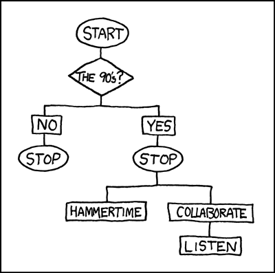

# Machine Learning {#ml}

In the [last session](#pm-t) our goal was to predict the salary a NBA player
receives based on the position they play, the points they make per game on 
average, their age, their team and the season. While we were able to make some
predictions, the results indicated that the model can and should be improved on.
We have now arrived at the entry gates to machine learning (ML). ML is also all
about prediction. The goal is to train a model that can predict an outcome with
the highest accuracy, a natural fit for our endeavour.

## Objectives
::: {.objectives}
- Understanding the Machine Learning approach to data analysis
- Using the *tidymodels* framework to run a linear regression and a random forest model
- Assessing and comparing model performance
- Tuning and choosing a sensible model

:::


## R functions covered this week
::: {.functions}
-   `set.seed()`: A base R function that sets the starting point for the *Random Number Generator* (RNG). Used to make steps that involve random elements as sampling or computing a random forest model reproducible.
-   `tidymodels` functions used for handling the data:
    -   `initial_split()`: Splis the data into training and test set.
    -   `training()` & `testing()`: Extracts the training and test set from a split object.
    -   `vfold_cv()`: Creates a training set with k-fold cross validation.
-   `recipe()`: `tidymodels` function that creates a recipe used in the machine learning workflow. Holds the model formula and additional optional pre-processing steps.
-   `tidymodels` functions used to set up an algorithm:
    -   `linear_reg()`: Sets up a linear regression algorithm to be used in the machine learning workflow.
    -   `rand_forest()`: Sets up a random forest algorithm to be used in the machine learning workflow.
    -   `set_engine()`: Chooses the function/package that actually implements the algorithm.
    -   `set_mode()`: Chooses between "regression" and "classification" mode for the chosen algorithm.
-   `tidymodels` functions used to set up a workflow:
    -   `worfklow()`: Creates an empty workflow.
    -   `add_recipe()` & `add_model()`: Used for adding the recipe and algorithm to the workflow.
-   `fit_resamples()`: `tidymodels` function used to fit a model with k-fold cross validation.
-   `collect_metrics()`: `tidymodels` function used to output the performance metrics for a fitted model.
-   `collect_predictions()`: `tidymodels` function used to output the predictions a fitted model made for the data.
-   `tidymodels` functions used for tuning a model:
    -   `tune()`: Sets up a hyperparameter to be tuned.
    -   `grid_regular()`: Creates a grid with values to be used during tuning.
    -   `tune_grid()`: Fits the model using the specified values for chosen hyperparameters.
    -   `show_best()`: Outputs the fitted models and their hyperparameter values by a chosen performance metric.
    -   `autoplot()`: Used on an object containing fitted models from tuning, it automatically plots the performance metrics by hyperparameter values.
-   `last_fit()`: `tidymodels` function used to fit the model on the training data and predict on the testing data.
-   `extract_fit_parsnip()`: `tidymodels` function used to extract the model object from a fitted model, e.g. from `final_fit()`, for further use, i.e. predictig on new data.

:::

## Intro to Machine Learning

In general there are two types of machine learning - there are actually more,
but let us not overcomplicate things for now - *supervised* and *unsupervised*
ML. In unsupervised machine learning the algorithm tries to identify structures
and patterns in the data and group them. We do not have an outcome variable
with known values. Rather the outcome variable is the grouping and it is
learned from the data itself. For our NBA data we could for example
try to find groups of players that are similar to each other based on several
characteristics. This grouping may go beyond the position they play on and shed
further light on commonalities of players that receive comparable salaries. But
this is not what we are going to do today. We are going to use supervised ML.

In supervised machine learning we work with a known outcome variable, salary in
our case. The goal of the algorithm is to learn the relationship between the
independent and the outcome variables from the data where the true value is 
known and then predict the outcome for new cases where the true value is not
known. This is basically the same we tried to achieve last week.

Let us inspect an example to clear up some of the confusion. Spam filters are
machine learning models. Based on a large number of examples, many many E-mails
for which we know if they are spam or not, the model learns which words in a
mail increase the chance of it being spam and which increase the chance of it
being a regular E-mail. 
If we now present a new mail to the model, it examines all the 
words in the text and computes the probability of this being a spam mail based
on the learned relationships between the words and the outcome, spam or no spam.
If the probability is high enough, the model flags the mail as spam. This is a
*classification* problem. Deciding whether an observation belongs to a specific
group or not.

Supervised machine learning can also be applied to *regression* problems,
predicting the actual value of an outcome. This is what we need when we want to
predict the salary of NBA players based on their characteristics.

At this point, it is still unclear what the actual differences between using a
linear regression and a supervised machine learning algorithm for a regression
problem are.

While there are some differences in the way a ML algorithm achieves its best
solution to how a linear regression does, this is not important to us here. 
The key differences for us lie in the available algorithms, of which some are
exclusive for machine learning, and in the approach machine learning takes to
preparing and analysing the data.

There are many machine learning algorithms available today and they are getting
more. Some are exclusive to classification problems, some to regression problems
and some can do both. All have their advantages and disadvantages so it is
important to choose wisely. In this introduction we will limit ourselves to two
algorithms. First we will use *linear regression*. Wait, that is what we have
been doing all along! You are right. Linear regression actually works the same
in the machine learning context but the logic of applying it differs, as we will
see below. The second algorithm we will use is called a *random forest*. This
will work very differently from linear regression, but more on that later.
Among the other common algorithms used for regression problems are
*support vector machines* (SVM) and different variants of linear regression like
*lasso-* and *ridge-regression*.

This leaves the second key difference, the approach we take to preparing and
analysing the data in the machine learning context.

### Training- and testset

When we conducted our linear regressions over the last sessions our approach was
to take the whole of the data and compute the model based on all observations.
In supervised machine learning we take a different approach.
We will take our data and split it into a *training* and a *test set*.

The training set will be used to actually *train* the model. It will learn the
relationships between the outcome and the independent variable based solely on
this subset of observations.

The test set is held back until our model is ready. Only then we can use it to
assess the quality of our predictions. As we know the true values for the 
outcome variable in the test set, we can compare the predictions with the 
actual values. Why do we go this extra route? In the last week we tested the
quality of our predictions on the same data the model learned from, why do we
not do this now?

The ultimate goal of machine learning is to predict the outcome for new
observations for which we do not know the true values. We have no way to assess
if these predictions were correct because we do not know the correct value.
So we do have to test our model on data for which we know the true value. 
But if we now train and test our model on the same data, we can potentially run
into a problem called *overfitting*.
The more sophisticated our algorithm, the more we may be
able to perfectly or near perfectly describe all the relationships in our data.
Imagine a regression line that goes exactly through every data point. The
problem with this is that in the new data we want to predict on, the data points
will not fall exactly as they did in the data the model was trained on. They
will distribute differently and our overfitted model that is super-specific to
the training data fails to make accurate predictions for the new data. What we
want is a model that describes the relationships in the data accurately,
but that is not overly specific to the training data; that is able to generalise
to new data.

For this reason the data is split into training and test set. We train the model
on the training data and when we are done, we test it *one time*, read 
**ONE TIME**, on the test set.
The test set is essentially new data to the model; it has not seen it before. If
it performs well on this new data for which we know the true values, we can be
confident that it will perform comparably well on completely new data.

This also means that the test set can only be used once. If we see that the 
performance on the test set is lacking, change some parts of the model and apply
it to the test set again, we are essentially training on the test set.
But what if we still want to optimise our model? We could for example change the
algorithm, add variables or tune *hyperparameters* (more on that later). We can
not do this with the simple training/test split, as the test set shall not be
used for optimising. What we can do instead is use *k-fold crossvalidation*.
With this method we split up our training set into $k$, often $10$, folds. 
During model training $9$ of these $10$ folds are used for training and $1$ is
left out to evaluate the performance of the model, i.e. the quality of its 
predictions. This is then repeated $9$ times with a different fold that is held
back for evaluation. In this way we can train and evaluate the model on the
training set, leaving the test set untouched.

This was a lot, but we believe it will get clearer once we actually apply it.


## Our baseline model

In the last session we constructed a linear regression model with the goal of 
making predictions. Can we improve on this model? To assess this we should
recompute it here and again inspect the measures for model comparison.

First we have to load the data and preprocess it. Here we transform `salary` to
a logarithmic scale and now also bake the squared version of the point average
into the data set. As we are planning to use all the performance stats for the
players in the later models, we also transform those statistics that are still
saved as character variables into numerical ones. `team` is transformed into a
factor variable because some algorithms are not good in handling character
variables. We will also need complete observations, i.e. observations without
any missing values. As the variables relating to college and the draft contain
many missings, we remove them before using `na.omit()` to delete all 
observations that have any missings left.

```{r nba_data_ml, warning=FALSE, message=FALSE}
library(tidyverse)
load("../datasets/nba/data_nba.RData")

data_nba <- data_nba %>% 
  mutate(salary_log = log(salary),
         career_PTS_2 = career_PTS ^ 2,
         `career_FG%` = as.numeric(`career_FG%`),
         `career_FG3%` = as.numeric(`career_FG3%`),
         `career_FT%` = as.numeric(`career_FT%`),
         career_PER = as.numeric(career_PER),
         career_TRB = as.numeric(career_TRB),
         `career_eFG%` = as.numeric(`career_eFG%`),
         team = as.factor(team)
  ) %>% 
  select(-c(college:draft_year)) %>% 
  na.omit()
```

We can now recompute our best model from last session.

```{r best_model_lw, warning=FALSE, message=FALSE}
last_week <- lm(salary_log ~ career_PTS + career_PTS_2 + 
                  position_center + position_sf + position_pf + position_sg + position_pg +
                  age + team + season_start,
                data = data_nba)
```

We are not interested in any coefficients right now and only want to inspect the
model fit statistics to have a baseline we can compare our machine learning 
models to. In particular we are interested in the $R^2$ and the RSME. Both
measures are easily obtainable in the machine learning framework we will use and
serve our purpose well.

```{r best_model_lw_r2_rmse, warning=FALSE, message=FALSE}
library(broom)

glance(last_week)


library(Metrics)

data_nba_last_week <- augment(last_week, data = data_nba)

rmse(data_nba_last_week$.fitted, data_nba_last_week$salary_log)
```

We achieved an $R^2$ of about $40.7$ and an RSME just shy of $1$. This will be
our baseline to compare all further models to.


## Setting up tidymodels

For this introduction to machine learning we will use the `tidymodels`
framework. There are many packages for machine learning available, often
specific to one algorithm. The beauty of `tidymodels` is that it brings them
all together under one framework. This means that we do not have to learn the 
syntax for each of these packages. We just have to swap out the algorithm in
our code and everything else can stay the same when switching between those.
`tidymodels` also handles the split into training and test set as well as the
crossvalidation for us and all output is presented in the same reliable way.

### Splitting the data

Let us start by splitting our data into both sets. This split is random, meaning
that every time we repeat the split, different observations will be placed in 
the sets. As we want our work to be reproducible, one of the pillars of good
scientific work, we have to ensure that the split always places the same 
observations in each set. We can do this by setting a seed right before 
splitting. `set.seed()`, with an arbitrarily chosen number between the 
brackets, sets the starting point of the *random number generator* in R. If we
set the seed and then split, then set the seed and split again, we will have the
exact same result every time. The split itself is conducted with
`initial_split()` applied to our data object. As a default the function places
$75\%$ of observations into training and the remainder into the test set. We
could change this ratio via an argument, but for our purposes the split looks 
good. We then extract the actual sets using `training()` and `testing()` on the
split respectively.

```{r initial_split, warning=FALSE, message=FALSE}
library(tidymodels)

set.seed(1234)
nba_split <- initial_split(data_nba)

nba_train <- training(nba_split)
nba_test <- testing(nba_split)
```

To set up the folds for crossvalidation, we use `vfold_cv()` applied to the
training set. The default number of folds is $10$.

```{r cross_validation, warning=FALSE, message=FALSE}
nba_folds <- vfold_cv(nba_train)
```

### Defining the recipe

We also have to write a `recipe()` for the model. At the very least the recipe
has to include the model formula and the data it should be applied to. The 
syntax for the model formula works the same way as it does with `lm()`. We could
also add additional so called "steps" to the model. These mainly are used to
transform variables that are used in the recipe. For example we could use
`step_log()` to logarithmise our outcome variable or `step_string2factor()` to
transform `team` into a factor variable. We have already taken care of all
transformations above
but the possibility to include them in the recipe is there. This can be 
especially helpful when we want to include these steps in some models but not in 
others. If we were not already sure that we want `salary` to be logarithmised,
we could set up one recipe were the step is included and one were it is not and
see what happens in our models using different recipes.

While the syntax is the same as with `lm()`, we expanded our formula somewhat.
Besides the variables we are already familiar with, we also included all
additional performance stats the data set offers. The performance of a player
will be relevant to the salary they receive. In general better players should
earn more. Up to now we only included the point average as a measure of
performance in our models. While points will be a central measure, other
measures of performance may also substantially impact the received salary,
especially for positions that do not score much but fill other roles in the 
team.

```{r recipe, warning=FALSE, message=FALSE}
nba_rec <- recipe(salary_log ~ age + career_PTS + career_PTS_2 + 
                    career_AST + `career_FG%` + `career_FG3%` + `career_FT%` +
                    career_TRB + career_WS + `career_eFG%` +
                    season_start + team +
                    position_center + position_sf + position_pf + position_sg + position_pg,
                  data = nba_train)
```

## Linear regression

Having built a recipe, we also have to specify the algorithm to be used.
The first algorithm we want to use here is linear regression. Linear regression
basically works the same way in machine learning as you have gotten to know and
love it over the last sessions. So we do not need to go into the details again 
and can just set up our algorithm. 
The function `linear_reg()` specifies that we want to
compute a linear regression. We also have to specify the "engine" we want to
use. This is the function or package that is used for the actual computation of
the model.
`tidymodels` is just the framework, it does not provide any model computations 
itself. These are always conducted by functions from other packages. In this
case we use the well known `lm()` function from base R. What `tidymodels` 
actually does, is to sent our model specification to `lm()`, let the function do
the crunching and return the results to us.

```{r setting_up_lr, warning=FALSE, message=FALSE}
lr_spec <- linear_reg() %>% 
  set_engine("lm")
```

Now that we have a recipe and specified an algorithm we still have to neatly
pack up both of them in a `workflow()`. We can add the recipe using
`add_recipe()` and the chosen algorithm using `add_model()`.

```{r setting_up_lr_wf, warning=FALSE, message=FALSE}
lr_wf <- workflow() %>% 
  add_recipe(nba_rec) %>% 
  add_model(lr_spec)
```

Now we can finally run our first machine learning model. `fit_resamples()` is
used to fit a model using crossvalidation. We have to supply it with our
workflow, the object holding the folds and some optional arguments as written
below. `save_pred = TRUE` ensures that the predictions from the models are saved
with it so that we can later access them. We could add `verbose = TRUE` to
`control_resamples()`, making the function put out
its progress in the console. This is especially useful when we run more 
complicated models that may take minutes or even hours to complete. Luckily
linear regression is really fast and this will be done in moments.

```{r resampling_lr, warning=FALSE, message=FALSE}
lr_m <- fit_resamples(
  lr_wf,
  nba_folds,
  control = control_resamples(save_pred = TRUE)
)
```

Now that the model is completed we can access the performance metrics using the
convenient `collect_metrics()`. We could have specified additional metrics to
be collected when we ran the model, but the defaults include all we need here.

```{r metrics_lr, warning=FALSE, message=FALSE}
collect_metrics(lr_m)
```

We can now compare this linear regression with additional variables to our
baseline from above. We actually did improve but only very little. The $R^2$ is
about $2\%$ higher and the RMSE about $0.01$ lower compared to the baseline.
That is nice but not the big improvement we would have hoped for.

Before we move on, further trying to improve our model, we should quickly learn
how to access the predictions the model actually made. There is another handy 
function in `tidymodels` that does just that, `collect_predictions()`.

```{r predictions_lr, warning=FALSE, message=FALSE}
collect_predictions(lr_m)
```


## Random forest

Another widely used machine learning algorithm, and one that moves away from
regression as we know it, is the *random forest*.
But what is a random forest? A random forest is an ensemble of
*decision trees*. Ok, nice... But that did not really help. So let us
rephrase: What is a decision tree?

You may already know the basics of what a decision tree is if you have ever
seen a flowchart. Consider this for example:



Imagine a new data point entering the flowchart from the above. At the first 
fork the data is divided by being from the 90s or not. If the data is not from 
the 90s the decision tree concludes and the observation is placed in the group
"Stop". If the observation is from the 90s it takes the other route and is 
either placed in "Stop, Hammertime!" or "All right stop, Collaborate and 
listen" based on another, here not displayed, variable, maybe the taste in
music.

While this is obviously a joke, the idea behind a real decision tree as they
are used in machine learning is the same. Data enters the tree from the stem and
is more and more subdivided by the observations' values on their associated 
variables into different branches. At each fork one variable is considered and
the data set is divided in a way that best divides the two groups based on their
values on this one variable. At the next fork another variable is considered and
another division takes place, and so on. When the tree can not make any more
sensible divisions a branch ends in a leaf or node and the observation gets
assigned an outcome value.

In our NBA example the decision tree may first divide the data by the
points scored. Maybe players who make more than $10$ points go in one group and
players that make less go into another. At the next fork the position may be 
considered, dividing centers and others and so on. At some point certain 
branches end and the model can assess the outcome values of the observations in
this leaf. If everything worked out, players with similar salaries and 
characteristics should be grouped in similar leafs at the ends of similar
branches. If we now put a new observation into the tree, the model can predict
their salary by making the observation follow the path through the tree based on
their characteristics.

While decision treed are fast and efficient they lean towards overfitting and 
are very unstable, as small changes to the training data can produce a
completely different tree. This is where random forests come back in. In a
random forest many decision trees are combined into one large model. At the same
time, for each tree the algorithm at random picks a subset of the variables that
are part of the complete model and only uses these in building this single tree.
This ensures that each tree is build differently. When all trees are build, they
are combined into one model. In this way and by introducing the random element,
random forests can combine the strengths of many trees while mitigating the
weaknesses of the same.

Now let us build our one random forest. We do not have to specify the recipe
again as nothing has changed, we only have to specify the algorithm we want to
use. We can set up a random forest using `rand_forest()`. Here we can also
set how many trees our forest should consist of. The default value of $500$
serves for our purpose. We again have to set an engine,
with `ranger` being a common choice. As random forests can tackle regression as
well as classification problems, we also have to specify what our problem is, 
using `set_mode("regression")`. We then build a new workflow with the old recipe
and the new model.

```{r setting_up_rf, warning=FALSE, message=FALSE}
rf_spec <- rand_forest(trees = 500) %>% 
  set_engine("ranger") %>% 
  set_mode("regression")

rf_wf <- workflow() %>% 
  add_recipe(nba_rec) %>% 
  add_model(rf_spec)
```

We can now run the random forest model exactly as we ran the linear regression
above. The only thing that has changed is the workflow used. Please take note
that computing a random forest is somewhat more computationally involved and may 
take some time, depending on your machine. 
As we are using crossvalidation we are
also actually computing 10 models in each run, so that adds up. We are still
below a running time of one minute here, but more complex algorithms can take
several minutes or even hours.
We should also not forget to set a seed again. As the *random* forest has a
*random* element, setting the seed ensures that we will get the same model
every time we run the code below. Without the seed, we would end up with 
different trees in our forest, each time we rerun the code.

```{r resampling_rf, warning=FALSE, message=FALSE}
set.seed(1234)

rf_m <- fit_resamples(
  rf_wf,
  nba_folds,
  control = control_resamples(save_pred = TRUE)
)
```

Let us look at the central metrics.

```{r metrics_rf, warning=FALSE, message=FALSE}
collect_metrics(rf_m)
```

The random forest model we computed shows a considerably higher
performance compared to our linear regression model. The $R^2$ of $64.7$
is a substantial improvement over the $42.9$ we achieved before. The same goes 
for the RMSE which dropped to $0.775$ compared to $0.985$. This is all going in
the right direction.

### Tuning the forest

While the random forest algorithm already performed substantially better 
compared to our linear regression out of the box, we may be able to improve it
even more. Many algorithms have so called *hyperparameters*. These are 
parameters of the model that can not be learned from the data itself but that we
have to *tune* in our code. While a linear regression has no hyperparameters, 
random forests have three. For one we can increase the number of trees that are 
used in building the forest. We will put this aside for now. We could also
change the number of randomly selected variables that are considered for each
tree, but we will not do this here. What we will tune is the minimal node size.

The minimal node size tells the algorithm how small each ending for each branch
is allowed to be. The default value for regression problems in *ranger* is $5$.
This means that the algorithm stops if it can not further subdivide our data
into groups that contain at least $5$ observations. If we allow the model to
create subdivisions with smaller groups, the model will get more fine grained
leading to potentially more accurate predictions. At the same time this will
lead to a model that is not as general, i.e. that is more prone to overfitting
to the specificities of our data and that will be less able to also make
accurate predictions for new data. We should keep this in mind when choosing
the best model later.

We could now move forward by just trying out smaller values than $5$ for the
minimal node size, but `tidymodels` again gives us a more convenient way.
When creating our model specification, we can tell `tidymodels` that we want to
tune a hyperparameter instead of setting it manually. We do this here by 
including the argument `min_n = tune()`, with `min_n` being the hyperparameter
for minimal node size in ranger. After creating the model specification, we 
again create a workflow including it.

```{r setting_up_tunable_rf, warning=FALSE, message=FALSE}
rf_spec_tune <- rand_forest(min_n = tune(), trees = 500) %>% 
  set_engine("ranger") %>% 
  set_mode("regression")

rf_wf_tune <- workflow() %>% 
  add_recipe(nba_rec) %>% 
  add_model(rf_spec_tune)
```

We also have to give *tidymodels* a tibble that includes the values for the
hyperparameter that we want to try out during tuning. 
The function `grid_regular()` helps us with this. Inside the brackets we have to
tell it which hyperparameter we want to tune, in this case `min_n()`. For some
hyperparameters `tidymodels` can automatically choose sensible values; for
`min_n` we have to set these ourselves, specifying a range we want to tune in.
The argument `levels` sets how many values should be
created in the specified range. Setting the grid up as below will lead to each 
integer between $1$ and $5$ being considered.

```{r tuning_grid, warning=FALSE, message=FALSE}
rf_grid <- grid_regular(
  min_n(range = c(1, 5)),
  levels = 5
)

rf_grid
```

Everything is prepared and we can start tuning. For this we use the function
`tune_grid()`. We have to give it the new tunable workflow and also the grid of 
values we want to tune for. This will again take more time to complete. We still
have $10$ folds, but now we also try $5$ different values for `min_n` for each
fold. That is $5 * 10 = 50$ models that have to be computed.

```{r tuning_rf, warning=FALSE, message=FALSE}
set.seed(1234)

rf_tune <- tune_grid(
  rf_wf_tune,
  nba_folds,
  control = control_resamples(save_pred = TRUE),
  grid = rf_grid
)
```

We can now compare the performance of the models with different values for
`min_n`. We could use `collect_metrics()`, but the more models there are to be 
compared, the less practical this gets. `show_best()` gives us an ordered output
of the models performance for a specified metric. We can also use the
`autoplot()` function which automatically plots us the same values.

```{r metrics_tuned_rf, warning=FALSE, message=FALSE}
show_best(rf_tune, metric = "rmse")
show_best(rf_tune, metric = "rsq")
autoplot(rf_tune)
```

We can clearly see, that the lower we set `min_n`, the better our model
performance gets. The best results are actually achieved with `min_n = 1`. 
But what does a minimal node size of $1$ imply? Our trees are then build in a
way that subdivides the data until some groups will only include one
observation. So they are in part tailor made for single observations. 
That sounds a lot like overfitting! Our forest may be able to make very
good predictions for these single observations but potentially may have problems
generalising to new observations. So we should not get greedy and just focus on
the model with the best performance and instead choose a more balanced option.
Looking at the plot we can see that the largest gain in performance is made when
switching from a minimum value of $5$ to $4$. For lower values the gains are
relatively minor. $4$ seems like a sensible choice.

We can now set up our final model specification, using `min_n = 4`. Here we also
increase the number of trees used to $1000$. We also build a workflow using this
final specification.

```{r select_best_rf, warning=FALSE, message=FALSE}
rf_spec_final <- rand_forest(min_n = 4, trees = 1000) %>% 
  set_engine("ranger") %>% 
  set_mode("regression")

rf_wf_final <- workflow() %>% 
  add_recipe(nba_rec) %>% 
  add_model(rf_spec_final)
```

## Last fit

We could of course go on and tune the other hyper parameters or try completely
different algorithms, but for this introduction we can be content with the level
of performance we have achieved so far, and which is already a substantial
improvement over the quality of predictions from [last week](#pm-t).

So far we have set aside our test data. We will now use it for a final test of
our model. Does our model perform equally well with new data or did we overfit?
If it does perform well on the test data, we can be confident that it will do 
the same with completely new data. If it does not, we have overfit to the
training data.

The function `last_fit()` does just that. It recalculates the model on the 
complete training data and makes predictions based on this on the test data.

```{r last_fit, warning=FALSE, message=FALSE}
set.seed(1234)

best_model_test <- rf_wf_best %>% 
  last_fit(nba_split)
```

We can than check the quality of these predictions. 

```{r last_fit_metrics, warning=FALSE, message=FALSE}
collect_metrics(best_model_test)
```

This look very good. We would have a problem if the metrics were considerably
worse compared to what we achieved during training and tuning. In this case we
would have overfitted to the training data. As our metrics from the last fit are
comparable to what we have achieved during training, we can be confident that
our model generalises well to new data. The metrics still indicate that there 
will be an error. Our predictions are not perfect, but it is the best we can
achieve right now.

All that is left to do is to save the fitted model in an object using 
`extract_fit_parsnip()`.

```{r last_fit_extract_model, warning=FALSE, message=FALSE}
best_model <- extract_fit_parsnip(best_model_test)
```

We will not do this here, but we could now for example use this model object
to make predictions for new data, as we have done for hypothetical players 
[last week](#pm-t). If you want to try this, remember that you also have to
set up values for the additional variables used in computing this week's model
in the new data.

## Going forward

If we wanted to further improve our model, we could try different things.
We could reconsider which variables we use in the model. Maybe we used to many
performance metrics, maybe there are other relevant variables we missed.
Algorithms like *lasso regression* can for example help with selecting relevant
variables from a large number by applying *feature selection*.

We could also potentially alter our pre-processing steps. 
While we have included a measure for the non-linear
relationship between points and salary, we have not done so for other 
performance metrics. Maybe their relationship is also non-linear in part, which
we may be able to capture using additional transformations.

There are many more algorithms, some of which we have already alluded to above,
which may be more suited to the task at hand. 
Depending on the algorithm used, we can also tune the available hyperparameters
and see how this affects performance.

Every machine learning problem is different and there are no ready made gold
standard solutions. Experience helps, but sometimes trying different algorithms,
tuning them and comparing their performance is the way to go.


## Further resources
::: {.resources}
- Lantz, Brett (2019). Machine Learning with R. Expert techniques for predictive modeling. Third Edition. Packt: Birminghan: An introduction to machine learning using R. Covers different algorithms for supervised and unsupervised learning as well as topics that are more general like approaches to model improvement.

- [Gatto, Laurent (2020). An Introduction to Machine Learning with R](https://lgatto.github.io/IntroMachineLearningWithR/): This is an online book that introduces the basic concepts and techniques of machine learning with R. It covers topics such as supervised and unsupervised learning, classification, regression, clustering, dimensionality reduction, and model evaluation. It also provides examples of applying machine learning methods to real-world data sets.

- Bzdok, Danilo, Naomi Altman & Martin Krzywinski (2018). Statistics versus Machine Learning. Nature Methods, 15(4). 233-234. Available under: <https://www.nature.com/articles/nmeth.4642>: The authors define what machine learning is by comparing it to "classical" statistics.

- Hvitfeldt, Emil & Julia Silge (2021). Supervised Machine Learning for Text Analysis in R. Available under: <https://smltar.com/>: A book on using ML in text analysis. This is a more specific use case compared to the resources above but well worth the read if you are interested in quantitative text analysis.

:::
