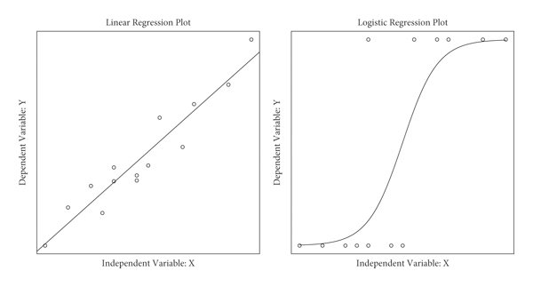

# Logistic regression {#log-est}

## Objectives
::: {.objectives}

- here to be filled

:::

## Functions covered in this week
::: {.functions}
- `glm()` : This function is used to fit a generalized linear model to the data. It takes a formula that specifies the dependent and independent variables, a data frame that contains the variables, and a family argument that specifies the type of model, such as binomial for logistic regression. It returns a model object that can be used for further analysis.
- `summary()` : This function is used to get a summary of a model object, such as the coefficients, standard errors, z-values, p-values, deviance, and AIC. It also provides information on the residuals, such as the minimum, maximum, median, and quartiles.
- `exp()` : This function is used to compute the exponential function of a numeric vector. It can be used to convert the log odds coefficients from a logistic regression into odds ratios.
- `tidy()` : This function is from the **broom** package. It is used to convert a model object into a tidy tibble that contains one row per parameter estimate and columns for the term, estimate, standard error, statistic, and p-value. It also has an argument to exponentiate the coefficients for logistic regression models.
- `glance()` : This function is from the **broom** package. It is used to get a summary of a model object, such as the deviance, AIC, BIC, pseudo R-squared, etc. It takes a model object and returns a tibble with one row per model and one column per statistic.
- `augment()` : This function is from the **broom** package. It is used to add columns with predictions, residuals, and other information to the original data frame. It takes a model object and an optional new data frame for prediction. It returns a tibble with one row per observation and one column per variable or statistic.
- `ggplot()` : This function is from the **ggplot2** package. It is used to create a wide variety of static, dynamic, and interactive graphics in R. The function allows you to specify a mapping from data to aesthetics (color, shape, size) and geometric objects (points, lines, bars). It also allows you to add statistical transformations, coordinate systems, faceting, and themes.
- `geom_count()` : This function is from the **ggplot2** package. It is used to create plots that show the number of observations at each combination of x and y values. It takes a mapping from data to aesthetics and other arguments that control the appearance of the points, such as color, size, alpha, etc. It returns a layer that can be added to a ggplot object.
- `stat_smooth()` : This function is from the **ggplot2** package. It is used to add a smoothed conditional mean or regression line to a plot. It takes a mapping from data to aesthetics and other arguments that control the appearance of the line or curve, such as method, formula, color, linetype, etc. It returns a layer that can be added to a ggplot object.
- `theme_minimal()` : This function is from the **ggplot2** package. It is used to apply a minimal theme to a plot. It takes no arguments and returns a theme object that can be added to a ggplot object.
- `margins()` : This function is from the **margins** package. It is used to compute marginal effects for various types of models in R. It takes a model object and other arguments that specify the variables of interest, the type of marginal effects (response or link), etc. It returns an object that contains the average marginal effects and their standard errors for each variable.
- `summary.margins()` : This function is from the **margins** package. It is used to get a summary of an object returned by `margins()`. It takes an object of class margins and other arguments that control the confidence intervals and p-values for marginal effects. It prints out a summary table of marginal effects.
- `model_performance()` : This function is from the **performance** package. It is used to get various indices of model performance for different types of models in R. It takes a model object and other arguments that specify which indices to include or exclude. It returns an object that contains indices such as AIC, BIC, pseudo R-squared, RMSE, log loss etc.
- `r2_mcfadden()` : This function is from the **performance** package. It is used to compute McFadden's pseudo R-squared for generalized linear models in R. It takes a model object and returns an object that contains McFadden's R-squared and adjusted R-squared values.
- `compare_performance()` : This function is from the **performance** package. It is used to compare multiple models based on their performance indices in R. It takes one or more model objects and other arguments that specify which indices to include or exclude. It returns an object that contains a table that shows the performance indices and their relative weights for each model.
- `check_model()` : This function is from the **performance** package. It is used to check the model assumptions and perform diagnostics for different types of models in R. It takes a model object and other arguments that specify which checks to perform or exclude. It returns an object that contains a list of diagnostic plots and tests for the model.
- `createDataPartition()` : This function is from the **caret** package. It is used to create a random split of the data into training and testing sets. It takes a vector of outcomes, a proportion of data to be assigned to the training set, and an option to return a list or not. It returns a vector or list of indices for the training set.
- `train()` : This function is from the **caret** package. It is used to train a predictive model using different methods and tuning parameters. It takes a formula that specifies the dependent and independent variables, a data frame that contains the training data, a method that specifies the type of model, and a train control object that specifies how to train the model. It returns a model object that can be used for prediction and evaluation.
- `trainControl()` : This function is from the **caret** package. It is used to create a train control object that controls how the model is trained. It takes various arguments that specify the resampling method, the number of resamples, the selection metric, etc. It returns a train control object that can be passed to `train()`.
- `predict()` : This function is used to make predictions from a fitted model object. It takes a model object and a new data frame that contains the values of the independent variables for which predictions are desired. It returns a vector of predicted values for the dependent variable.
- `ggpredict()` : This function is from the **ggeffects** package. It is used to create predicted values and confidence intervals for different types of models in R. It takes a model object and one or more terms that specify which variables to predict for. It returns an object that contains predicted values and confidence intervals for each level of the terms.
- `library()` : This function is used to load an installed package into R session so that its functions can be used. It takes one or more package names as arguments and loads them into memory.

:::

## Basic concepts

Logistic regression is similar to linear regression. The main difference is that 
it can perform better for binary variables (i.e. 0 vs. 1). Binary outcomes have 
only two levels. Linear regression is used to model continuous variables such as the number of points scored in an NBA game. A binary outcome would be the sex of the player (male vs. female) or the maybe the health status (injured vs. not injured).

Logistic regression and linear regression are both part of the family of 
generalized linear regression models (including also Poisson regression, ridge, lasso etc.).
Logistic regression and linear regression share some of the same assumptions, such
as linearity, outliers and multicollienarity.However, under the hood, logistic 
regression uses a different estimation method. 


Rather than fitting a straight line through data points as in linear regression,
logistic regression fits a "s-shaped" line through data points. Coefficients in 
the logistic model are interepreted as the probability of being category 1 or 0. 




Linear regression uses ordinary least squares as estimation method (i.e. using the distance from each observation to the regression line). Logistic regression uses the "maximum likelihood function" to approximate the s-shape curve which best fits the data. It moves the s-curve left and right and
calculates for each observation the likelihood of being either 0 or 1 given the assumed distribution. Then we take the average of all likelihoods of observations. The best fitting 
curve is the one with the largest likelihood (that's why it is called "maximum likelihood function").

See this [youtube](https://www.youtube.com/watch?v=yIYKR4sgzI8&list=PLblh5JKOoLUKxzEP5HA2d-Li7IJkHfXSe&ab_channel=StatQuestwithJoshStarmer) playlist on logistic regression for more details. 

## Application

Let's apply logistic regression to our NBA data. 

```{r prep, warning=FALSE, message=FALSE}

# load packages
library("tidyverse")
library("readxl")
library("lubridate")

# import data 
nba_salaries <- read_csv("../datasets/nba/salaries_1985to2018.csv", show_col_types = FALSE)
nba_players <- read_csv("../datasets/nba/players.csv", show_col_types = FALSE)

# merge
data_nba <- merge(nba_players, nba_salaries, by.x = c("_id"), by.y=c("player_id"))

# clean
data_nba <- data_nba %>%
        dplyr::select(everything(), -league, -highSchool) %>%
        filter(season_start>=1998) %>%
  mutate(year_of_birth = year(mdy(birthDate)),
         age = season_start - year_of_birth,
         position_center = 
      case_when(position = str_detect(position,"Center") ~ 1,
                TRUE ~ 0),
    position_sf = 
      case_when(position = str_detect(position,"Small Forward") ~ 1,
                TRUE ~ 0),
    position_pf = 
      case_when(position = str_detect(position,"Power Forward") ~ 1,
                TRUE ~ 0),
    position_sg = 
      case_when(position = str_detect(position,"Shooting Guard") ~ 1,
                TRUE ~ 0),
    position_pg = 
      case_when(position = str_detect(position,"Point Guard") ~ 1,
                TRUE ~ 0),
    weight = str_replace(weight, "lb", ""),
         weight = as.numeric(weight),
         height = str_replace(height, "-", "."),
         height = as.numeric(height),
    ) %>%
  rename(id = "_id") %>%
  dplyr::select(id, name, age, weight, height, birthPlace, everything(), -position, -birthDate, -year_of_birth)

data_nba <- data_nba %>%
  group_by(id) %>%
  mutate(seasons_played = n()) %>%
  ungroup()
str(data_nba)

```

First, let's check out dataset for binary outcomes. Binary variables in R are
labelled as *factor* variables. Any categorical variable is a factor variable.
A binary variable is simply a categorical variable with two categories.

```{r log-0, warning=FALSE, message=FALSE}
str(data_nba)
```

We see that there are no *factor* variables currently in the dataset. However, 
there are a few variables that should be marked as factors which currently 
aren't, such as birth place, college, draft team, and the shooting hand (left/right hand).
If we want to use any of these variables in a regression, we need to convert them.
Currently they are marked as "character" variables. 

Let's assume we are interested in knowing how long a player plays in the NBA 
measured by the number of seasons he played. It could be very useful for teams to predict
how long players will last. 

Let's first look at that variable, dichotomize it (turning it into 0 vs. 1), and
then explore it's distribution.

```{r log_1, warning=FALSE, message=FALSE}
library("ggeffects")
# check distribution of original variable
summary(data_nba$seasons_played) 

# dichotomize
data_nba <- data_nba %>%
  mutate(career_long = 
           case_when(seasons_played>12 ~ 1,
                     seasons_played<=12 ~ 0,
                     TRUE ~ NA_real_),
         career_long = as.factor(career_long))

table(data_nba$career_long)

data_nba %>%
  filter(team =="Dallas Mavericks") %>%
  ggplot(aes(x= seasons_played, y=career_long)) +
  geom_count() +
  # stat_smooth(method="glm",
  #              se=FALSE, 
  #              method.args = list(family=binomial),
  #              formula= aes(career_long ~ seasons_played)) +
  theme_minimal()


# NIAZ - plot below should show the logistic regression curve, but doesnt work
# Reason: Insufficient unique x values: the variable seasons_played has insufficient unique values to support the smoothing method or they fall in one line
```

The plot above shows the number of players for the Dallas Mavericks by career length
and seasons played. The size of the bubble represents the number of players in that 
category.

Now, let's estimate a model explaining whether a player has a long career or not.
Let's include weight and height as independent variables

```{r log_2, warning=FALSE, message=FALSE}

model_logit1 <- glm(career_long ~ height + weight,
                    data = data_nba,
                    family = binomial)

summary(model_logit1)

```

## Interpretation

The interpretation of coefficients in a logistic regression is different from 
the linear model. In a linear model, coefficients are interpreted as the increase 
on the y-scale for one unit increase in x. For logistic regression, coefficients
relate to the increase or decrease of the probability (measured in log odds) that 
y= 1 for a one unit increase x. 

In the output above, we see that the coefficient for height is -0.16. This means 
that for every inch (~ ca. 2.5 cm) in height, the probability of having a long career
is 0.16 log odds lower. This suggests that taller people have shorter NBA careers.

In practice no one interprets the effect size in log odds. In the standard logistic 
regression model, we only look at the p-value to see if the effect is statistically
significant and we look at the sign in front of the coefficient to check whether
the effect is positive or negative. 

A more meaningful way to interpret effects are odds ratios. Log odds can be 
converted using the following approach. 

```{r log_3, warning=FALSE, message=FALSE}
exp(coef(model_logit1))
```

Now, the effect of height is 0.84. This means that the probability of a long career
is 0.85 times higher for taller people than for smaller people. If the odds ratio 
is 1, the probability would be the same. If it is 2, the probability would be twice
as high. If it is lower than 1, it means that the probability is lower and that
the effect is negative. 

There is an alternative `tidyverse` way to get odds ratios using the `broom()` package.
It neatly converts the output into a table which makes it easier to graph later.

```{r log_4, warning=FALSE, message=FALSE}

model_logit1 %>% 
      broom::tidy(exp = TRUE)
```


More recently, it has become more common to convert the coefficients into probabilities.
There are various packages and various options and no clear agreement on what is
the preferred output. 

Documentation for the `ggeffects` [package](https://strengejacke.github.io/ggeffects/index.html) and the `margins` [package](https://thomasleeper.com/margins/) capture this discussion in detail. In the following, we will show you how to get Average Marginal Effects
and Average Predicted Probabilities. 

The interpretation of Average Marginal Effects (AMEs) is more intuitive than log odds
or odd ratios. AMEs are the average change in probability of y occurring for each unit increase
in x. 

```{r log_5, warning=FALSE, message=FALSE}

# get average predicted probabilities for each level of "height"
predicted <- broom::augment(model_logit1, type.predict = "response") %>%
  group_by(height) %>%
  summarise(mean_fitted = mean(.fitted, rm.na=T))

# same as above, just using "ggpredict"
#install.packages("ggeffects")
library("ggeffects")
ggpredict(model_logit1, "height")

# ggpredict
#install.packages("ggeffects")
library("ggeffects")
ggpredict(model_logit1, "height")

# get Average marginal effects
library("margins")
library("broom")

# Average Marginal Effects - for all model variables
margins(model_logit1, type = "response")

# Only for some
summary(margins(model_logit1, variables = "height"))

```

The AME for height is -0.029. This means that for every additional inch in height,
the NBA players are ~ 3 percentage points less likely to have a long career.


## model fit

As we have seen with linear regression, there are different ways to assess whether a model is actually "good". For linear regression, a popular measure is the R-squared which reports the "percentage of variance in y which is explained by the model". 
For logistic regression, there is no consensus on what the best measure is. There are dozens of different ways to calculate different r-squares. It's complicated. See [here](https://www.youtube.com/watch?v=xxFYro8QuXA&ab_channel=StatQuestwithJoshStarmer) for more in-depth technical discussion. 

One way to get model performance measures is the `performance` package. One r2
that is often recommended is the McFadden pseudo r2. This measure should not 
be interpreted as "percentage of variance" explained. It is useful as a relative
tool. Larger values are better than smaller values. 

```{r log_6, warning=FALSE, message=FALSE}
performance::model_performance(model_logit1)
performance::r2_mcfadden(model_logit1)
```

Let's add some variables to our model:

```{r log_7, warning=FALSE, message=FALSE}
model_logit2 <- glm(career_long ~ height + weight + position_center + position_pg +
                      season_start,
                    data = data_nba,
                    family = binomial)
```

Now, let's compare models

```{r log_8, warning=FALSE, message=FALSE}
performance::r2_mcfadden(model_logit1)
performance::r2_mcfadden(model_logit2)
```
As we can see, the second model has a larger pseudo r2 and this can be considered the better model. 

Another way to compare models is the performance package:

```{r log_9, warning=FALSE, message=FALSE}
performance::compare_performance(model_logit1, model_logit2)

```


## diagnostics

Testing model assumptions and performing diagnostics is trickier for logistic regression compared to linear regression. Many diagnostics revolve around analyzing residuals (difference between predictions and actual values). In the context of logistic regression, given that the predicted values are probabilities and the actual values are either 0 and 1, it is not very clear what residuals mean.

We won't cover diagnostic tests for logistic regression here, mainly to save time. A deeper dive into diagnostics can be found [here](http://www.sthda.com/english/articles/36-classification-methods-essentials/148-logistic-regression-assumptions-and-diagnostics-in-r/). A more recent package used in machine learning, called "performance" can also be used for diagnostics using the `check_model` function. 


## prediction

Predicting outcomes based on logistic regression was already covered above because predicted probabilities are an easier way of interpreting coefficients. 

Here, let's predict whether certain "fake" players
will have a long career or a shorter career based on our model. 


```{r log_10, warning=FALSE, message=FALSE}
#define new observation
newdata = data.frame(height=c(5.0, 8.0),
                     weight=c(mean(data_nba$weight),
                              mean(data_nba$weight)))


#use model to predict value of am
predict(model_logit1, newdata, type="response")
```

The results above show that a very short player (5 feet) has a 27% probability of having a long career, whereas a very tall (8 feet) player only has a 18% probability of having a long career. Maybe taller people get injured more. 

## Mediation

Remember week X when we discussed mediation analysis based on linear regression?
Mediation is also possible for logistic regression, however, it is more complicated.
There are dedicated packages that help users apply mediation analysis following
`glm(models)` such as the `khb` package.

## comparing linear and logistic regression

As we have seen above, logistic regression can cause many headaches because
assessing the model fit, testing diagnostics, prediction and diagnostics are
all very complicated to perform and interpret. 

```{r log_11, warning=FALSE, message=FALSE}

# logistic regression
model_glm <- glm(career_long ~ height + weight + position_center + position_pg +
                      season_start,
                    data = data_nba,
                    family = binomial)
margins(model_glm, type = "response")

# same model as linear regression
model_lm <- lm(as.numeric(career_long) ~ height + weight + position_center + position_pg +
                      season_start,
                    data = data_nba)
summary(model_lm)

```

As we can see, the Average Marginal Effects calculated based on the logistic 
regression model are almost identical compared to the linear regression coefficient. 
This is why in applied research, many scholars simply use OLS regression for binary
outcomes. It is easier to apply, easier to interpret and the results are very similar
in logistic regression. 

As a rule of thumb, many researchers consider using logistic regression when
the probabilities are extreme, so many 99% or 1% cases. In these cases, linear
regression could predict values higher than 100% or lower than 1%, which is, of course,
not possible. However, if most predicted probabilities are between 20-80%, linear
regression models have many advantages.

Example: If you’re modeling the probability of an NBA player to play more than 5 seasons, then nearly all the modeled probabilities will be between .20 and .80, and a linear probability model should fit nicely and offer a straightforward interpretation. Alternatively, consider you want to predict which player will score on average 30 points per game. This probability is likely
between .000001 and .20. In that situation, the linear model just isn’t viable, and you have to use a logistic model or other alternatives.

For a more in-depth discussion see [here](https://statisticalhorizons.com/linear-vs-logistic/).


## logistic regression in Machine Learning context

Such like linear regression, logistic regression is one of the algorithms which
are used in the context of Machine Learning to predict outcomes. 

There are many alternatives to logistic regression when predicting binary outcomes such as ...,...,.... These appraoches go far beyond the scope of this course. Predicting binary outcomes is often called "classification" in machine learning.
Imagine you have 50 million pictures of animals and you want to predict whether
an image contains a cat. Being a cat or not is a binary outcome, so logistic regresison could be used in this context. 

In the following, we provide a very short introduction on how to use logistic regression in a machine learning appraoach using the `caret` package. 

```{r log_12, warning=FALSE, message=FALSE}
library(caret)

# Create a train and test split
set.seed(123)  # For reproducibility
train_indices <- createDataPartition(data_nba$career_long, p = 0.7, list = FALSE)
train_data <- data_nba[train_indices, ]
test_data <- data_nba[-train_indices, ]

# Create a train control object
ctrl <- trainControl(method = "none") 

# Train a linear regression model using caret
model1 <- train(
  career_long ~ height + weight + position_center + position_pg +
                      season_start,
  data = train_data,
  method = "glm",
  trControl = ctrl
)


# Make predictions on the test set
predicted_career_m1 <- predict(model1, newdata = test_data,
                               type = "prob") %>%
  mutate(predicted_class_binary=`1`)
                         
```

The above yields our predicted probabilities for `career_long` for every observation in the test dataset. Previously, we have used `RMSE` to evaluate how good the predictions were. Again, this is different for models with binary outcome models since there are no "residuals" in the classic sense. 
Instead, a common metric for assessing model performance is "accuracy". Accuracy measures which percentage of the actual values (whether someone had a long career or not) are corrected predicted by the model. Other metrics are kappa, sensitivity, specificity. The so-called "confusion matrix" compares the predicted "classes" with the actual "classes" in the training data and computes all these metrics:

```{r log_13, warning=FALSE, message=FALSE}
test_data$pred_career <- predicted_career_m1$predicted_class_binary
test_data <- test_data %>%
  mutate(predicted_class_binary = 
           case_when(pred_career>0.5 ~1,
                     pred_career<=0.5 ~0,
                     TRUE~ NA_real_),
         predicted_class_binary = as.factor(predicted_class_binary))

str(test_data)

confusionMatrix(data=test_data$predicted_class_binary, reference= test_data$career_long)
```

The confusion matrix shows that the model predicted short careers (0) for 668 players who actually had long careers (1). It correctely predicted the career for 2249 players. Overall, the career that players had was predicted accurately in 77% of cases. 


## Further resources
::: {.resources}
- [Machine Learning with R: A Complete Guide to Logistic Regression](https://www.r-bloggers.com/2021/01/machine-learning-with-r-a-complete-guide-to-logistic-regression/): This is a blog post that explains how to use logistic regression for predictive modeling in R, using the trees data set as an example. It covers how to fit, visualize, and evaluate linear regression models, as well as how to calculate confidence and prediction intervals.
- [Logistic Regression in R Tutorial](https://www.datacamp.com/tutorial/logistic-regression-R): This is a web page that provides a step-by-step tutorial on how to perform logistic regression in R using both base-R and tidymodels workflows. It also shows how to interpret the model output, assess model performance, and make predictions.
- [Logistic Regression Essentials in R](http://sthda.com/english/articles/36-classification-methods-essentials/151-logistic-regression-essentials-in-r/): This is a web page that introduces the basic concepts and techniques of logistic regression in R. It covers topics such as model assumptions, diagnostics, odds ratios, marginal effects, and model comparison. It also provides examples of applying logistic regression methods to real-world data sets.
- [How to Use predict() with Logistic Regression Model in R](https://www.statology.org/r-logistic-regression-predict/): This is a web page that shows how to use the predict() function in R to make predictions from a fitted logistic regression model. It also explains the difference between type = "response" and type = "link" arguments, and how to use new data for prediction.

:::
